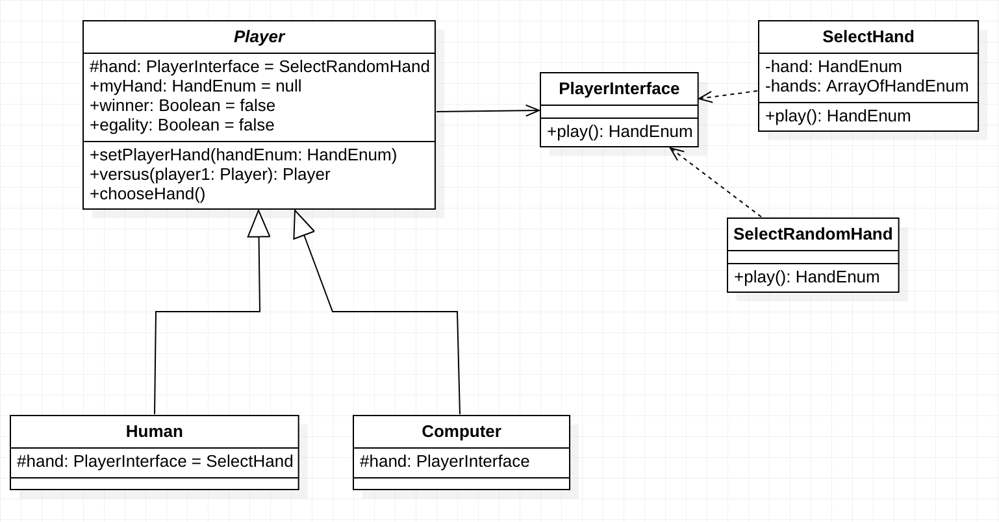

# Shifumi

Shifumi ou Pierre-papier-ciseaux est un jeu effectué avec les mains et opposant un ou plusieurs joueurs (voir [Shifumi Wikipedia](https://fr.wikipedia.org/wiki/Pierre-papier-ciseaux) pour plus d’information :tongue:).

Dans le cadre d’un processus de recrutement il a été demandé de réaliser une application du jeu Shifumi sur Android de preference avec le langage Kotlin.

## Environnement et outils de développement

**IDE :**  Android Studio (Version 3.6.3)

**Gradle :**  Version 3.6.2

**SDK minimum :**  23

**Langage :**  Kotlin

**Tests Unitaire :**  JUnit 4

**Tests Instrument :**  Espresso

**Support de test :**  Smartphone Android 9 (API 29)

## Télécharger et Exécuter le code

Pour télécharger et exécuter le projet plusieurs méthode s'offre à vous. Dans notre cas j'expliquerais celle que je prefere les autres méthodes il vous suffit de Googler :stuck_out_tongue_winking_eye:

### Ma méthode préferé

1. Ouvrir Android Studio ensuite sélectionner `Check out project from Version Control` [Fig 1](https://github.com/GraceBK/Shifumi/tree/master/SCREENSHOT/fig1.png) ensuite cliquer sur Git [Fig 2](https://github.com/GraceBK/Shifumi/tree/master/SCREENSHOT/fig2.png)
Ensuite copier ce lien `https://github.com/GraceBK/Shifumi` dans [Fig 3](https://github.com/GraceBK/Shifumi/tree/master/SCREENSHOT/fig3.png)
Attendre que le téléchargement soit terminé

2. Aller dans `Open an existing Android Studio project` ensuite aller à la racine du projet et ouvrir

3. Pour Exécuter Selectionner votre support entre device (téléphone Android) ou un simulator (Android).

## Architecture du projet

### Diagramme de class

Dans l'image ci-après le Diagramme de classe de mon programme (Sauf les classes utilisant les composants Android ie: les Activity)

## Les tests

~~70% de temps pour le code et 30% pour les tests~~ :scream_cat:

J'ai réalisé 2 types de test:

- Les tests unitaires avec JUnit (dans le fichier GameTest)

Je test les régles (quelque :speak_no_evil:) du jeu

- les tests Instrumentés avec Espresso (dans le fichier SplashScreenTest et GameIntrumentedTest).

## ScreenShot

Pour avoir un apperçu de l'application se réferer aux images de `img1.jpeg` à `img5.jpeg` contenu dans le dossier [./SCREENSHOT](https://github.com/GraceBK/Shifumi/tree/master/SCREENSHOT)
